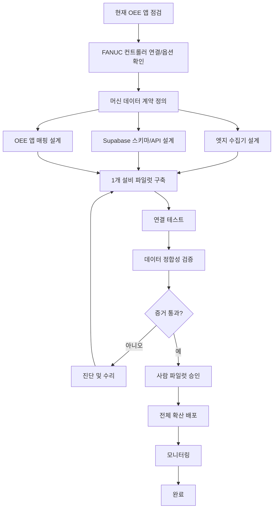

# graph-engineering-skill

[](LICENSE)
[](graph-engineering/SKILL.md)
[](#설치)

자연어로 말한 의도를 **검증된 실행 그래프(node · edge · state)** 로 변환해,
Claude Code와 Codex가 그대로 실행할 수 있는 워크플로우 계약 문서(`GRAPH_<TASK>.md`)를 만들어주는 설치형 Skill.

프롬프트 한 줄이 아니라 **작업의 구조 자체**를 설계합니다. 무엇이 병렬로 돌 수 있는지,
무엇을 검증해야 하는지, 어디서 사람이 승인해야 하는지를 실행 전에 확정합니다.

---

## 왜 필요한가

에이전트에게 긴 작업을 시키면 두 가지 일을 동시에 합니다 — **과제를 푸는 일**과 **작업의 구조를 매번 다시 발견하는 일**.
후자를 문서로 고정하면 실행이 빨라지고, 관찰 가능해지고, 실패가 격리됩니다.

| 선형 루프의 문제 | 그래프의 해법 |
|---|---|
| 독립 작업까지 줄을 서서 대기 | 의존 없는 노드는 병렬 실행 |
| 중간 하나가 죽으면 전부 중단 | 실패한 가지만 재실행, 체크포인트 재개 |
| "결과 나쁘면 재시도"를 표현 못 함 | 조건부 엣지 + 재시도 상한을 그래프에 내장 |
| 완료 주장이 검증되지 않음 | 완료 증거(evidence)와 검증 게이트 강제 |

> 그래프는 모델을 똑똑하게 만들지 않습니다. **워크플로우를 혼동하기 어렵게** 만듭니다.

---

## 한눈에 보는 실제 예제 — 공장 설비(FANUC) 데이터 자동 수집

설명보다 그래프 하나가 빠릅니다. 아래는 이 패키지에 포함된 실전 예제([`OEE_FANUC_EXAMPLE.md`](graph-engineering/examples/OEE_FANUC_EXAMPLE.md))로, **스킬이 실제로 만들어 낸 그래프**입니다.

**구독자의 한 문장 의도:**

> "FANUC Robodrill 설비의 생산 카운터·알람·가동/비가동 데이터를,
> 작업자가 수기로 옮기지 않아도, 기존 Supabase 기반 OEE 앱에 자동으로 넣고 싶다."

**스킬이 만들어 낸 실행 그래프** (GitHub에서 아래 다이어그램이 그대로 렌더됩니다):



이 그래프가 "그냥 지시"보다 나은 이유 — 네 가지 포인트:

- **병렬(fan-out)** — `C`(데이터 계약)가 정해지면 `D1·D2·D3`(수집기·DB·앱 매핑)는 서로 독립이라 **동시에** 설계합니다.
- **증거 게이트** — `H{증거 통과?}`는 모델의 "된 것 같아요"가 아니라 실측 증거(카운터 값 일치, 알람 타임스탬프 보존, 재연결 시 중복 없음 등)로 판정합니다.
- **복구 루프** — 실패하면 `H → I(진단·수리) → E(재구축)`로 되돌아갑니다. 그냥 멈추지 않습니다.
- **사람 승인 게이트** — 전체 확산(`K`) 전에 반드시 `J[사람 파일럿 승인]`을 거칩니다. 생산 라인에 영향을 주는 비가역 작업이기 때문입니다.

전체 계약(목표·선택 방식·핵심 증거)은 [`OEE_FANUC_EXAMPLE.md`](graph-engineering/examples/OEE_FANUC_EXAMPLE.md)에서 볼 수 있습니다.

---

## 설치

### Windows (cmd) — 전역 설치

```cmd
curl -fsSL https://raw.githubusercontent.com/batman3101/graph-engineering-skill/main/install.cmd -o "%TEMP%\ge-install.cmd" && "%TEMP%\ge-install.cmd"
```

### macOS / Linux / WSL — 전역 설치

```bash
curl -fsSL https://raw.githubusercontent.com/batman3101/graph-engineering-skill/main/install.sh | bash
```

### 프로젝트 전용 설치

현재 폴더에만 설치하려면 `-p` 옵션을 붙입니다. (팀원과 Git으로 공유할 때 유용)

```cmd
:: Windows
curl -fsSL https://raw.githubusercontent.com/batman3101/graph-engineering-skill/main/install.cmd -o "%TEMP%\ge-install.cmd" && "%TEMP%\ge-install.cmd" -p
```

```bash
# macOS / Linux / WSL
curl -fsSL https://raw.githubusercontent.com/batman3101/graph-engineering-skill/main/install.sh | bash -s -- -p
```

### 설치기가 하는 일

1. GitHub에서 최신 스킬을 내려받습니다.
2. `claude` / `codex` 명령을 PATH에서 자동 감지합니다.
3. 감지된 도구의 스킬 폴더에 알아서 설치합니다.
   - Claude Code → `~/.claude/skills/graph-engineering/`
   - Codex → `~/.agents/skills/graph-engineering/`
4. 둘 다 감지되지 않으면 두 경로 모두에 설치합니다. 나중에 어느 쪽을 깔아도 바로 인식됩니다.
5. 재실행하면 기존 설치를 덮어쓰며 최신 버전으로 갱신됩니다.

### 수동 설치

`graph-engineering/` 폴더를 통째로 아래 경로에 복사하면 됩니다.

| 도구 | macOS / Linux | Windows |
|---|---|---|
| Claude Code | `~/.claude/skills/graph-engineering/` | `%USERPROFILE%\.claude\skills\graph-engineering\` |
| Codex | `~/.agents/skills/graph-engineering/` | `%USERPROFILE%\.agents\skills\graph-engineering\` |

---

## 사용법

### Claude Code

```text
/graph-engineering
현재 로그인 기능을 리팩터링하려고 한다.
먼저 실행 그래프를 만들고 graph lint를 통과시킨 뒤,
독립적인 작업은 subagent로 분리하고 각 단계의 completion evidence를 남겨라.
```

### Codex

```text
graph-engineering 스킬을 사용해서
이 요청을 GRAPH_AUTH.md 실행 계약으로 먼저 만들어줘.
lint를 통과한 뒤 node 순서대로 구현하고,
validation / recovery / approval 엣지는 건너뛰지 마.
```

### 권장 2단계 사용 (가장 안전)

**1단계 — 설계만**

```text
graph-engineering을 사용해 이 요구사항을 분석해.
아직 코드는 수정하지 말고 GRAPH_<TASK>.md만 만들어.
Complexity Gate, node contracts, validation, recovery,
parallel plan, Graph Lint까지 포함해.
```

**2단계 — 사람이 그래프를 검토한 뒤 실행**

```text
GRAPH_<TASK>.md를 실행 계약으로 사용해 구현을 시작해.
dependency-ready node만 실행하고, 각 node 완료 후 evidence를 남겨.
그래프에 없는 고위험 작업은 실행하지 마.
```

---

## 핵심 설계 규칙

스킬이 그래프를 만들 때 강제하는 규칙 중 일부입니다. 전체는 [`GRAPH_RULES.md`](graph-engineering/references/GRAPH_RULES.md) 참조.

- **Fake Edge 제거** — 먼저 작성했다는 이유만으로 화살표를 그리지 않습니다. 엣지는 다음 노드가 이전 노드의 *출력을 소비*하거나, *판정에 의존*하거나, *권한을 상속*할 때만 진짜입니다.
- **Complexity Gate** — 7개 축을 0–2점으로 채점해 단일 루프 / 선형 / 그래프 / 계층 그래프를 결정합니다. 순차 의존만 있는 작업에 그래프를 강제하지 않습니다.
- **Fresh-Context Verifier** — 작업자와 검증자는 절대 컨텍스트를 공유하지 않습니다. 공유하면 같은 루프가 자기 숙제를 채점하는 것과 같습니다.
- **Anchors** — 모든 노드가 서로의 *보고서*만 검사하면 전부 일관되지만 아무것도 검증되지 않습니다. 실제로 실행된 테스트, 실측 데이터, 동결 규칙 같은 반박 불가능한 신호가 최소 1개 필요합니다.
- **Fan-in Guard** — 종합 노드는 `받은 입력 수 == 기대 수`를 검사합니다. 부분 데이터로 "완료된 보고서"를 만들지 않습니다.
- **Routing Owner** — 모든 분기 엣지는 판단 주체를 명시합니다: `deterministic` / `model` / `human` / `external`. 규칙으로 결정 가능하면 deterministic을 우선합니다.
- **Human Gate** — 배포, 마이그레이션, 삭제 등 되돌릴 수 없는 작업 앞에는 반드시 사람 승인 노드를 둡니다.

---

## Graph Lint

스킬이 JSON DAG를 함께 생성하면 정적 검사를 돌릴 수 있습니다.

```bash
python graph-engineering/scripts/graph_lint.py graph-engineering/examples/SAMPLE_GRAPH.json
```

검사 항목:

| 심각도 | 검사 |
|---|---|
| ERROR | 존재하지 않는 node 참조 / 중복 id |
| ERROR | unreachable node |
| ERROR | 분기 엣지의 `routing_owner` 누락 |
| ERROR | loop 엣지의 종료 조건 누락 |
| WARNING | terminal node 없음 (사이클만 존재) |
| WARNING | high-risk node의 보상·승인 누락 |
| WARNING | 중요 node의 completion evidence 누락 |
| WARNING | fan-out의 `max_parallel` / `fanin_reducer` 누락 |
| WARNING | join node의 `expected_inputs` 가드 누락 |

---

## 구성

```text
graph-engineering/
├─ SKILL.md                         # 스킬 진입점 (트리거 · 16단계 워크플로우 · 핵심 규칙)
├─ references/
│  ├─ GRAPH_RULES.md                # 설계 규칙 20조
│  ├─ PATTERNS.md                   # 패턴 카탈로그 + Mermaid + 안티패턴
│  ├─ ADVANCED.md                   # fresh-context 검증 · 앵커 · fan-in 트랩 · 모델 티어링
│  ├─ GRAPH_SCHEMA.md               # node / edge / state YAML·JSON 계약
│  ├─ CODEX_ADAPTER.md              # Codex 실행 규약
│  └─ CLAUDE_CODE_ADAPTER.md        # Claude Code 실행 규약 (subagent · hook)
├─ templates/
│  ├─ GRAPH_WORKFLOW_TEMPLATE.md    # 정식 실행 계약 문서 (18개 섹션)
│  └─ GRAPH_SPEC_QUICK.md           # 소형 그래프용 붙여넣기 축약 스펙 5종
├─ examples/
│  ├─ OEE_FANUC_EXAMPLE.md          # 제조 설비 데이터 연동 실전 예제
│  └─ SAMPLE_GRAPH.json             # lint 통과 샘플 DAG
└─ scripts/
   └─ graph_lint.py                 # 정적 그래프 검사기
```

---

## 패턴 카탈로그

| 패턴 | 언제 쓰나 |
|---|---|
| **Pipeline** | 출력→입력 의존이 실제로 존재하는 구간 |
| **Fan-out / Fan-in** | 독립 작업을 병렬로 뿌리고 종합 노드에서 취합 |
| **Diamond** | 분기 → 병렬 → 검증 → 재수렴. 실전에서 가장 흔한 형태 |
| **Verifier Node** | 생성자와 분리된 검증. pass/fail 조건부 엣지 + 재시도 상한 |
| **Human Approval Gate** | 파괴적·대외적 작업 직전 |
| **Dynamic Discovery** | 규모를 미리 모르는 작업. 연속 2라운드 신규 발견 0이면 종료 |

자세한 Mermaid 예시는 [`PATTERNS.md`](graph-engineering/references/PATTERNS.md) 참조.

---

## 언제 쓰지 말아야 하나

그래프는 **폭(breadth)** 을 사는 도구이지 **판단력**을 사는 도구가 아닙니다.
아래에 해당하면 그냥 루프가 정답입니다.

- 한 함수 추가, 버그 하나 수정처럼 작고 고립된 작업
- 모든 단계가 진짜로 순차 의존적인 경우
- 무엇을 찾는지 아직 모르는 탐색 단계
- 매 단계를 직접 승인하고 싶은 경우

Fake Edge 테스트로 판별하세요. **엣지 없는 두 작업을 하나도 못 찾겠다면, 만들 그래프가 없는 것입니다.**

---

## 기여 · 라이선스

이슈와 PR 환영합니다. 라이선스는 [MIT](LICENSE).
