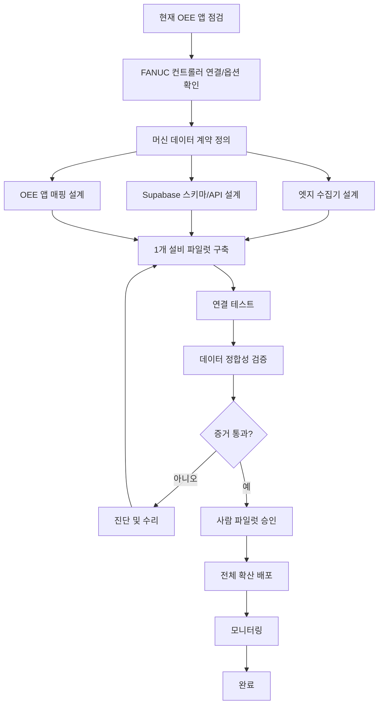

# GRAPH_OEE_FANUC_INTEGRATION — 예제

## 목표 (Objective)

작업자가 설비 데이터를 수기로 옮겨 적지 않아도, FANUC Robodrill 설비의 생산 카운터·알람·가동시간·비가동시간 데이터를 기존 Supabase 기반 OEE 애플리케이션에 자동으로 수집·적재한다.

## 선택한 방식 (Selected mode)

계층형 그래프(Hierarchical Graph). 이 작업은 설비 연결, 엣지(edge) 수집, 데이터베이스 계약, 애플리케이션 통합, 검증, 생산 라인 확산까지 여러 영역을 가로지르기 때문이다.

## 그래프 (Graph)

## 핵심 증거 (Key evidence)

- 정해진 표본 구간 동안 카운터 값이 설비 화면 표시와 일치한다
- 알람 타임스탬프가 보존된다
- 가동/비가동 합계가 허용 오차 범위 내에서 대사(reconcile)된다
- 재연결 시 레코드가 중복 생성되지 않는다
- 파일럿 기간 동안 기존 수기 OEE 워크플로우가 계속 사용 가능하다
