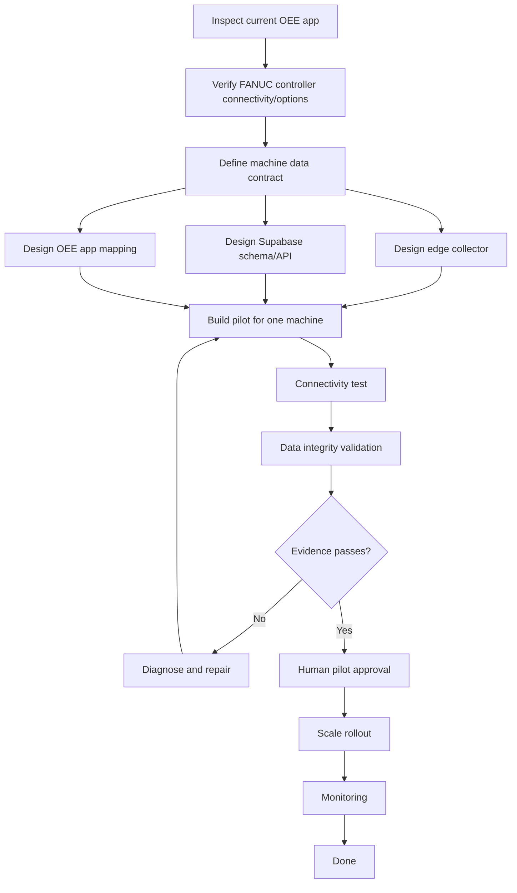

# GRAPH_OEE_FANUC_INTEGRATION — Example

## Objective

Automatically ingest FANUC Robodrill production counter, alarms, runtime, and downtime data into an existing Supabase-backed OEE application without requiring operators to manually duplicate machine data.

## Selected mode

Hierarchical Graph, because the work crosses machine connectivity, edge collection, database contract, application integration, validation, and production rollout.

## Graph

## Key evidence

- counter values match machine display over a defined sample window
- alarm timestamps are preserved
- runtime/downtime totals reconcile within accepted tolerance
- reconnect does not duplicate records
- current manual OEE workflow remains usable during pilot
