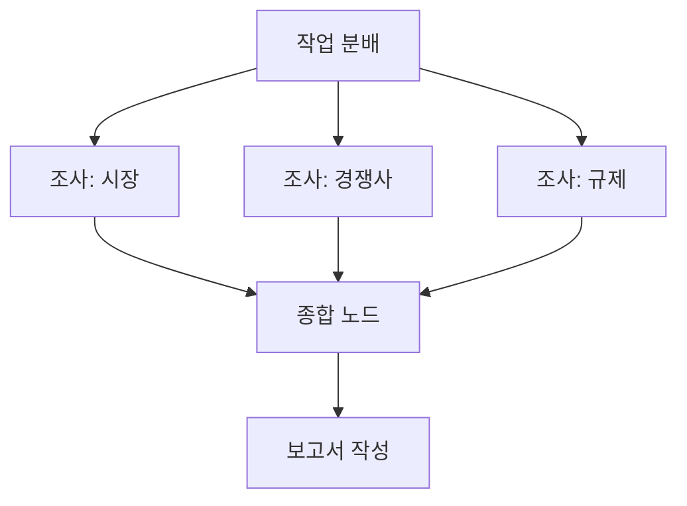
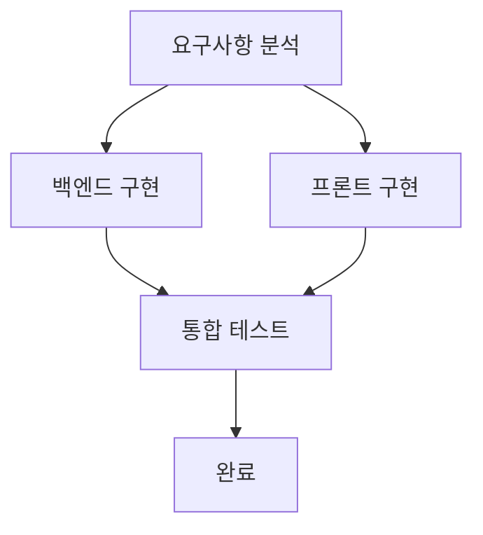
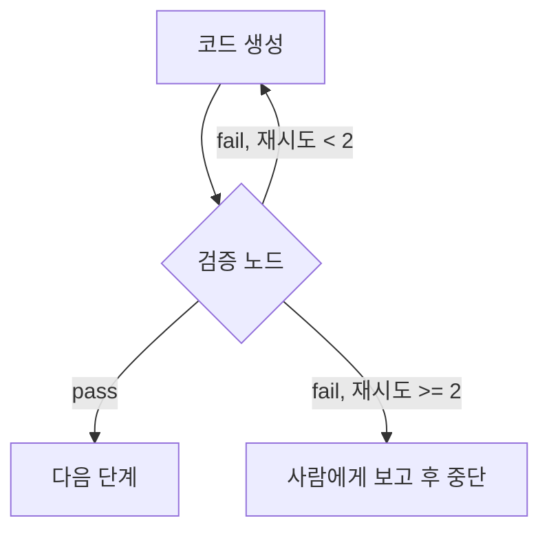
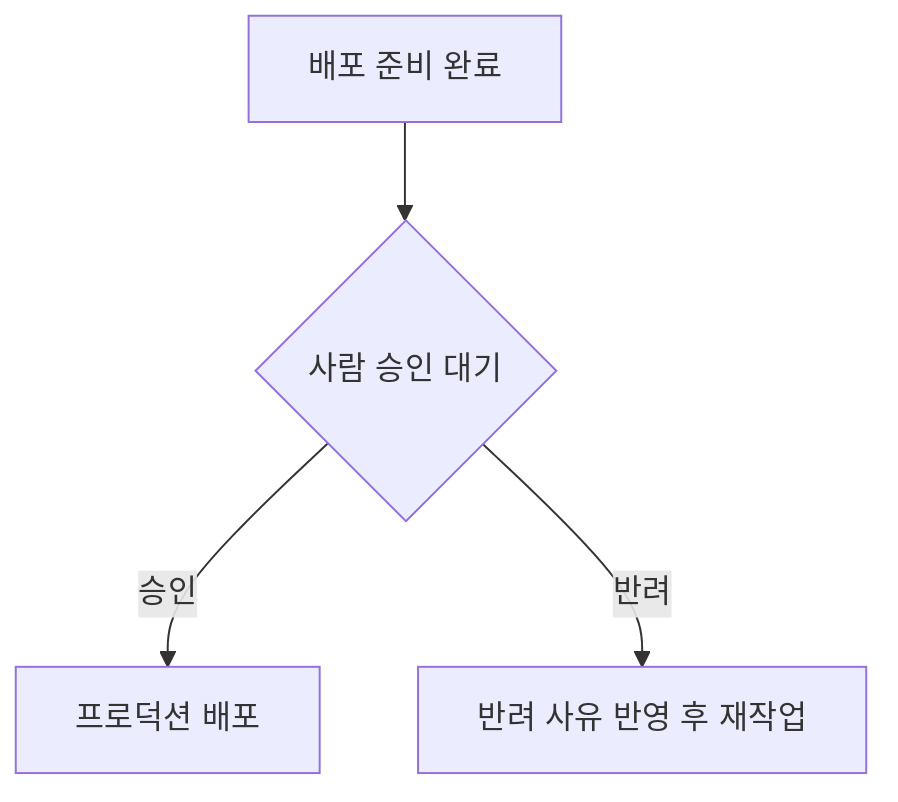

# Graph Engineering 패턴 카탈로그

## 1. Pipeline (파이프라인)
순서가 반드시 필요한 구간. 각 노드의 출력이 다음 노드의 입력.

사용 시점: 출력→입력 의존이 실제로 존재할 때만. 의존이 없으면 Fan-out으로 전환.

## 2. Fan-out / Fan-in (팬아웃/팬인)
독립 작업을 병렬로 뿌린 뒤 종합 노드에서 취합.

- Claude Code: 서브에이전트(Task tool) 3개 동시 실행
- Codex: 순차 실행 폴백 (결과 파일만 동일하게 유지)
- 규칙: 종합 노드는 **모든 가지가 끝난 후**에만 실행 (join 조건 명시)

## 3. Diamond (다이아몬드)
분기 → 병렬 → 재수렴. 실전에서 가장 흔한 형태.

## 4. Verifier Node (검증 노드)
생성자와 검증자를 분리. 조건부 엣지로 pass/fail 분기.

- 검증 노드는 생성 노드의 컨텍스트를 공유하지 않고 **산출물만** 보고 판정 (신선한 시각)
- 검증 기준은 체크리스트로 명시 (예: 테스트 통과, 린트 무오류, 요구사항 3개 충족)
- **재시도 상한 필수** — 상한 도달 시 사람에게 에스컬레이션

## 5. Human Approval Gate (승인 게이트)
파괴적/대외적 작업 직전에 배치.

대상: 배포, DB 마이그레이션, 데이터 삭제, 외부 이메일/메시지 발송, 비용 발생 작업.
지시문 예: "이 노드에 도달하면 작업을 멈추고 요약을 출력한 뒤 사용자의 명시적 승인을 기다릴 것."

## 상태(State) 관리 규칙

- 노드 간 데이터는 **파일**로 전달: `state/` 폴더에 노드ID 접두사로 저장 (예: `state/02_draft.md`)
- 각 노드는 시작 시 필요한 state 파일 존재 확인 → 없으면 선행 노드 미완료로 판단하고 중단
- 이 방식이 곧 체크포인트: 중단되어도 마지막 성공 노드부터 재개 가능

## 안티패턴

1. **Fake Edge**: 작성 순서 = 실행 순서로 착각. 출력 소비/판정 의존/권한 상속이 없으면 엣지 삭제
2. **무한 검증 루프**: 재시도 상한 없는 verifier → 반드시 상한 + 에스컬레이션
3. **과잉 그래프화**: 순서가 고정된 3단계 작업을 그래프로 포장 → 단순 체크리스트가 낫다. 그래프 도입 기준은 우아함이 아니라 실익(시간 단축, 실패 격리)
4. **거대 노드**: 한 노드가 여러 일을 함 → 입출력이 한 문장으로 설명될 때까지 분할
5. **암묵적 상태**: "앞에서 한 거 기억하지?" → 모든 전달 데이터를 state 파일로 명시
