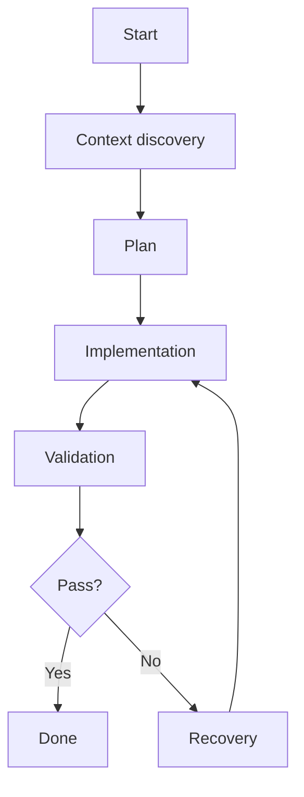

# GRAPH_<TASK_NAME>

## 1. Objective

<What outcome must exist when finished?>

## 2. Complexity Decision

- Score:
- Selected mode: Single Loop / Linear / Graph / Hierarchical Graph
- Reason:

## 3. Current Facts

- Repository/system facts verified before planning.

## 4. Constraints

- 
- 

## 5. Definition of Done

- [ ] 
- [ ] 
- [ ] 

## 6. Execution Graph



## 7. State Contract

```yaml
state:
  facts:
    owner: context
    merge: replace
  changed_files:
    owner: multiple
    merge: unique_union
  validation_results:
    owner: validator
    merge: replace
```

## 8. Node Work Contracts

### N1 — Context Discovery

**Objective**

**Reads**

**Writes**

**Preconditions**

**Actions**

**Outputs**

**Validation**

**Completion Evidence**

**Failure Route**

---

## 9. Parallel Plan

- Parallel groups:
- File ownership:
- State reducers:
- Fan-in node:

## 10. Validation Gates

- Build:
- Tests:
- Static checks:
- Runtime verification:
- Independent review:

## 11. Checkpoints / Resume

- 

## 12. Recovery / Compensation

- 

## 13. Human Gates

- 

## 14. Authority Boundaries

- 

## 15. Observability

- Events/evidence to capture:

## 16. Graph Lint Result

- [ ] No unreachable node
- [ ] Every loop has a stop condition
- [ ] Every decision has a routing owner
- [ ] Parallel writes are conflict-safe
- [ ] High-risk side effects have approval/compensation
- [ ] Success nodes satisfy DoD
- [ ] Completion claims require evidence

## 17. Coding Agent Execution Rules

1. Verify preconditions from current reality before each node.
2. Execute only dependency-ready nodes.
3. Parallelize only explicitly safe nodes.
4. Record concise node results and evidence.
5. Follow recovery edges on failure.
6. Do not silently broaden scope.
7. Do not execute high-risk operations without required authority.
8. Finish only after every DoD item is evidenced.

## 18. Final Report

- Completed nodes:
- Changed files:
- Commands/tests:
- Validation evidence:
- Remaining risks:
- Follow-up:
